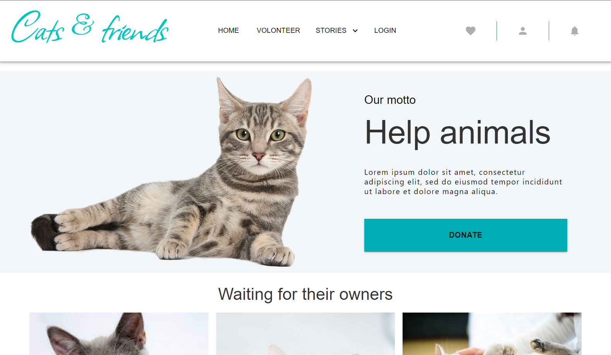
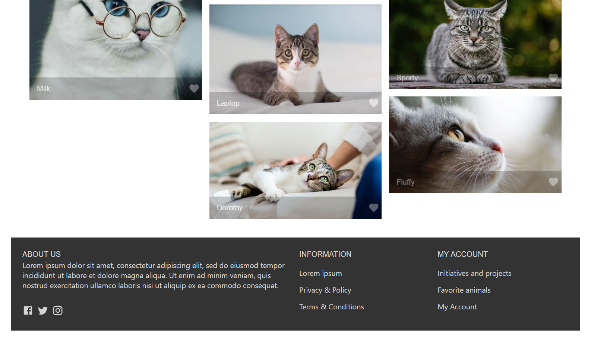

# React-cats-friends

A simple React application created using Material UI.
This was my project built during Online React Marathon at SoftServe IT Academy. Project goals included using Material UI.
I have to create an application with the following structure of elements:

Application is adaptive for mobile, laptop and desktop.
All styles and adaptive for this application were created using abilities of Material UI.

Technologies used:
- React
- Material UI

SetUp/Installation instructions:
- Clone this repository to your desktop
- npm install
- npm start
